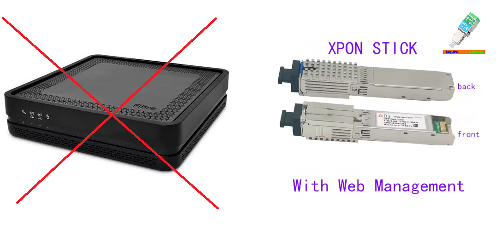

# DeVIVO

Coleção de ferramentas para configurar equipamentos de fibra ótica (XPON/GPON), permitindo a substituição do roteador da operadora por equipamentos próprios (como sticks ONU SFP).

[Adquira aqui teu XPON (ODI DFP-34X)](https://s.click.aliexpress.com/e/_c4pBS2Qd) | [Mediaconverter](https://s.click.aliexpress.com/e/_c3GeNieD) [[2](https://s.click.aliexpress.com/e/_c41mtwB7)] [[3](https://s.click.aliexpress.com/e/_c43qvRxR)] [[4](https://s.click.aliexpress.com/e/_c4UMBRRJ)] [[5](https://s.click.aliexpress.com/e/_c3OewGul)]

## Ferramentas

### 1. 📡 [Mitrastar Scraper](./mitrastar_scraper)

Uma ferramenta de extração de dados do roteador original da Vivo (Mitrastar).

- **Função**: Coleta dados sensíveis necessários para provisionamento em outro equipamento.
- **Dados Extraídos**: SLID (Senha PLOAM), Serial GPON, MAC Address, Versões de Hardware/Software.
- **Saída**: Gera um arquivo JSON pronto para ser usado pelo *ODI Autoconfig*.

### 2. ⚙️ [ODI Autoconfig](./odi_autoconfig)

Automatizador para sticks ONU da série **ODI DFP-34X** (e compatíveis Realtek).

- **Função**: Lê os dados extraídos pelo *Vivo Scraper* e provisiona automaticamente o stick.
- **Recursos**:
  - Clona o Serial GPON e SLID.
  - Configura parâmetros OMCI para emular o roteador original (Mitrastar).
  - **Auto-Detecção de VLAN**: Conecta via SSH para descobrir qual VLAN a OLT atribuiu e configura a interface WAN automaticamente.

## Fluxo de Trabalho Recomendado

1. **Extração**: Execute o `mitrastar_scraper` enquanto conectado ao roteador original da Vivo. Ele salvará um arquivo `.json` com todas as credenciais.
2. **Substituição**: Troque o roteador pelo stick ODI (conectado via Media Converter ou slot SFP).
3. **Configuração**: Execute o `odi_autoconfig`. Ele encontrará o arquivo JSON gerado anteriormente e aplicará as configurações no stick automaticamente.

---
⚠️ **Aviso Legal e Suporte**: 

Este projeto é disponibilizado "como está", apenas para fins educacionais e de pesquisa. A substituição do equipamento da operadora deve ser feita inteiramente por conta e risco do usuário.

**Não há suporte para este projeto.** Não abra Issues solicitando ajuda, suporte técnico. Pull Requests com correções ou melhorias são bem-vindos, mas Issues de suporte serão fechadas sem resposta.

